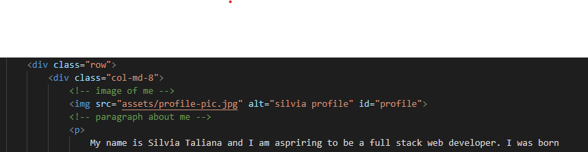

# My Biography

## About This Project

This project aims to create a biography using elements from bootsrap to create a responsive website viewable on multiple sized screens. 
To view this project [click here!](https://silvia-taliana.github.io/my-biography/)

The basic outline was created first for each page of the website (about me, portfolio, contact) and linked to bootstrap. Bootstrap has a library full of codes for a variety of tools that can be easily applied to a website. It was used in this project to insert a nav bar, contact form and submit button. 

## Installation

CSS styling was added to help place everything in the right position with padding, margins and position elements. However, to make the website responsive, the positioning had to change format to work with boostrap. In bootstrap, everything is divided into columns and rows to help the screen respond to changes in size. The basic rules for using rows and columns are to always work on the row first, then the columns within that row. The width of the page will always be divided into 12 columns so if there are more than 12 columns applied to a single row, the excess columns will automatically jump to the following row. If the amount of columns used does not add up to 12, there will be blank spaces for the remaining columns. This can be used to the advantage of web designers if a blank space is desired. An example of how the rows and columns are used in the html file is shown below. 

 

The number 8 in the class=col-md-8 refers to the number of colums that this section is taking up. The other 4 columns for this row were intentionally left blank so this section was not covering the whole screen and some of the background was allowed to show in the blank areas. 

## Usage

The above picture is an example of how the website looks on a typical phone screen. The nav bar has collapsed thanks to bootstrap so it fits well on the screen and will drop down to the different nav elements when clicked on by the user. 

## License

Creative Commons Attribution 4.0 International Public License 

MIT License